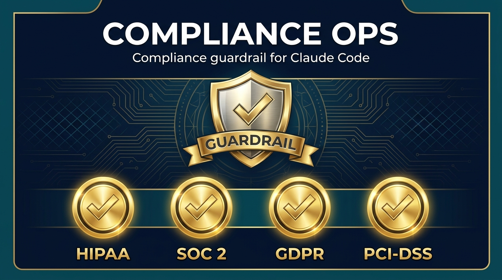

<p align="center">
  
</p>

# Compliance Ops

> Compliance guardrail for [Claude Code](https://claude.ai/code). Makes your AI build with **HIPAA, SOC 2, GDPR, and PCI-DSS** principles baked in — protected data stays out of non-compliant servers and flows, by design. A seatbelt and a paper trail, **not legal advice**.

<p>
  <a href="https://www.charlieautomates.com/charlie-os-vs/"></a>
  <a href="https://www.npmjs.com/package/compliance-ops"></a>
  <a href="https://www.npmjs.com/package/compliance-ops"></a>
  <a href="LICENSE"></a>
  <a href="https://github.com/charlesdove977/compliance-ops/stargazers"></a>
</p>

**A compliance guardrail framework for Claude Code.** It makes your AI aware of compliance rules *before* it builds anything — so every website, workflow, automation, and system it creates for you is designed with those principles baked in. Protected data never gets routed through non-compliant servers or flows, and you rest assured nothing leaks through a tool that was never allowed to touch it.

It is a **seatbelt and a paper trail** — not a compliance certificate.

> ⚠️ **Read this first.** Compliance Ops is **not legal advice**, and it does **not** make a Claude consumer subscription (Pro / Max / Team) able to process protected health information without breaking HIPAA. Those plans are excluded from Anthropic's Business Associate Agreement, and no skill changes that. What Compliance Ops does is help you **build with the right compliance principles and frameworks in mind**, and keep protected data out of the AI's path. Your compliance officer or counsel makes the final call.

---

## What it does

Most people bolt compliance on *after* they've built something — and by then the protected data has already flowed through three tools that never should have touched it. Compliance Ops flips that. It sits in front of the build:

1. **It interviews you first.** When you invoke it, it asks two questions: **what are you building?** and **what are you worried about?** (HIPAA / patient data, SOC 2 / customer data, GDPR / EU users, PCI / payments, "not sure"). 
2. **It loads the matching framework.** HIPAA, SOC 2, GDPR, and PCI-DSS — load one or several at once (an EU healthcare SaaS taking payments triggers all four). Each framework teaches your AI exactly when the regulation triggers and which vendors are actually covered.
3. **It designs the build correct-by-default.** Protected data is separated into its own "lane" and routed only through vendors that carry the right coverage for the regime — a BAA (HIPAA), a SOC 2 report + DPA (SOC 2), a DPA + transfer mechanism (GDPR), or a PCI-validated payment processor (PCI). The AI is kept *out* of the protected-data path entirely, unless you deliberately put it on a covered endpoint.
4. **It trips a wire if something's wrong.** If the AI is about to read patient records, or wire a no-BAA tool (like Zapier) into a flow carrying protected data, or POST that data to an uncovered host — it stops and tells you, before the build happens.
5. **It documents the boundary.** It generates a data-flow map and a vendor agreement checklist you can hand straight to your compliance officer.

The result: the AI builds and manages everything *around* your protected data — the website, the forms, the automations — without the protected data ever passing through it or through a vendor that isn't covered.

---

## How to activate it

Compliance Ops responds to **plain words, skills, or commands** — however you naturally work:

**Just talk to it.** It auto-activates on natural language:
- *"Is this HIPAA compliant?"* / *"Build this intake form HIPAA safe."*
- *"We need SOC 2 — is this build okay?"* / *"which of my vendors are SOC 2?"*
- *"I have EU users — is this GDPR safe?"* / *"do I need a DPA for this?"*
- *"Is my checkout PCI compliant?"* / *"where should the card form live?"*
- mentions of **compliance, HIPAA, PHI, BAA, SOC 2, GDPR, DPA, PCI, cardholder data, personal data**

**Or call the command directly:**

| Command | What it does |
|---|---|
| `/compliance-ops` | Interview + guard a new build |
| `/compliance-ops audit` | Audit an existing system for compliance gaps |
| `/compliance-ops document` | Generate the data-flow map + vendor BAA checklist for your compliance officer |

Once it's active, anything the AI builds in that session is shaped by the loaded framework — automatically.

---

## What's inside

```
compliance-ops/
├── bin/compliance-ops.js             # npx installer (install / update / uninstall)
├── package.json
├── assets/banner.png
└── skill/                            # the Claude Code skill payload
    ├── SKILL.md                      # Entry point — activation, persona, routing
    ├── tasks/
    │   ├── interview.md              # Default: ask what + worry, then guard the build
    │   ├── audit.md                  # Trace an existing flow, rank the gaps
    │   └── document.md               # Generate compliance-officer paperwork
    ├── frameworks/
    │   ├── compliance-principles.md  # Regime-agnostic core (the decision flow)
    │   ├── hipaa.md                  # HIPAA: triggers, eligible Claude surfaces, patterns
    │   ├── soc2.md                   # SOC 2: Trust Services Criteria, vendor two-part check
    │   ├── gdpr.md                   # GDPR: controller/processor, DPA + transfer mechanisms
    │   ├── pci-dss.md                # PCI-DSS: scope reduction, hosted fields, SAQ A
    │   ├── vendor-matrix.md          # Multi-regime vendor coverage table
    │   └── disclaimer.md             # The non-negotiable framing
    ├── templates/
    │   ├── data-flow-map.md          # Where protected data goes + who touches it
    │   └── vendor-baa-checklist.md   # Vendor-by-vendor agreement status
    └── checklists/
        └── phi-safety.md             # Pre-build tripwires (all regimes) — STOP if any fires
```

---

## The core idea (in one diagram)

```
   LANE 1 — NO PROTECTED DATA            LANE 2 — PROTECTED DATA
   (the AI builds + manages this)        (lives only in covered vendors)

   • Marketing website                   • Intake form (native covered form)
   • Content, code, SOPs                 • Records, notes, claims
   • Lead-gen, non-regulated lines       • Regulated automations

   No agreement needed.                  Covered by the right agreement for the
   AI works here freely.                 regime (BAA / DPA / SOC 2 / PCI processor).
                                         AI never enters unless on a covered endpoint.
```

Compliance Ops' whole job is to keep that wall standing and to prove it's standing on paper.

---

## Roadmap

- ✅ **HIPAA** — live (PHI, BAA, Bedrock-for-AI-on-PHI)
- ✅ **SOC 2** — live (Trust Services Criteria, vendor SOC 2 + DPA check, the six builder controls)
- ✅ **GDPR** — live (controller/processor, lawful basis, DPA + SCCs/DPF transfers, data-subject rights)
- ✅ **PCI-DSS** — live (scope reduction, hosted fields / tokenization, SAQ A, AI out of the CDE)
- 🔜 **CCPA, ISO 27001** — on the roadmap

More compliance frameworks are added over time. The framework-agnostic core applies to all of them; each regime then layers on its own triggers, vendor coverage, and tripwires.

---

## Install

**Via npm (recommended):**

```bash
npx compliance-ops install            # installs to ~/.claude/skills/compliance-ops/
npx compliance-ops install --project  # installs into ./.claude/ for the current project
npx compliance-ops install --with-commands   # also writes /compliance-ops slash-command stubs
```

Other commands: `npx compliance-ops update` (overwrite), `uninstall`, `where`, `--help`.

**Manual:** copy the `skill/` directory's contents into `~/.claude/skills/compliance-ops/` (so `SKILL.md` sits at the root of that folder).

**Charlie OS:** ships inside [Charlie OS](https://charlieautomates.com) by default — no separate install needed.

---

## Related projects

- **[Charlie OS](https://www.charlieautomates.com/charlie-os/)** — one-click Claude Code setup that bundles BASE, CARL, PAUL, SEED, Skillsmith, and 32 curated skills (Compliance Ops included). If you want Compliance Ops *plus* the rest of Charles's stack on day one, install Charlie OS instead.
- **[Work with Charlie](https://www.charlieautomates.com/charlie-os-vs/)** — done-for-you install, custom skill builds, and 1:1 Claude Code engineering for founders and agency operators (including regulated-industry builds).

---

## The honest disclaimer (again, because it matters)

Compliance Ops is a **build-time engineering guardrail**. It is **not legal advice**, it is **not a compliance certification**, and it **cannot** make a Claude consumer subscription handle protected health information without breaking HIPAA. It reduces the chance of a leak by keeping protected data out of the AI's reach and routing it only through covered vendors — but the final compliance determination always belongs to your compliance officer or qualified counsel.

---

Built by [Charles Dove](https://charlieautomates.com) · Charlie Automates.
